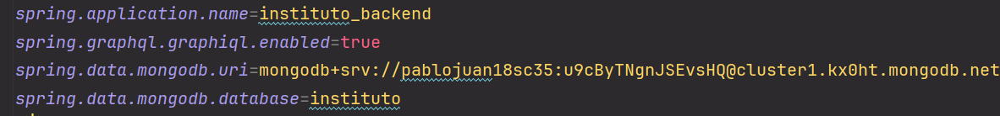

<p align="center">
  <a href="https://spring.io/" target="blank"></a>
</p>

# PROYECTO API

## Instrucciones

1. **Clonar el proyecto:**

    ```bash
    git clone https://github.com/Juan-Papi/instituto_backend.git
    ```

2. **Instalar Docker:**

   Asegúrese de tener Docker instalado en su sistema operativo. Puede descargarlo e instalarlo desde [aquí](https://www.docker.com/get-started).

3. **Configurar la conexión a MongoDB Atlas:**

   Edite el archivo `application.properties` ubicado en la siguiente ruta:

    ```plaintext
    .../instituto_backend/src/main/resources/application.properties
    ```

   Coloque sus credenciales de su clúster de MongoDB Atlas:

    ```ini
    spring.data.mongodb.uri=mongodb+srv://<USUARIO>:<CONTRASEÑA>@<CLUSTER>.mongodb.net/?retryWrites=true&w=majority&appName=<NOMBRE_APP>
    spring.data.mongodb.database=instituto
    ```

4. **Construir la imagen de Docker:**

   Ubíquese en el directorio del proyecto:

    ```bash
    cd /path/to/instituto_backend
    ```

   Luego ejecute el siguiente comando:

    ```bash
    docker build -t instituto_backend .
    ```

5. **Ejecutar el contenedor de Docker para la API GraphQL:**

   Ubíquese en el directorio del proyecto:

    ```bash
    cd /path/to/instituto_backend
    ```
   
    ```bash
    docker run -d -p 8080:8080 instituto_backend
    ```

## Notas

- Asegúrese de que el puerto `8080` no esté en uso por otra aplicación.
- Puede acceder a la API GraphQL en `http://localhost:8080`.

